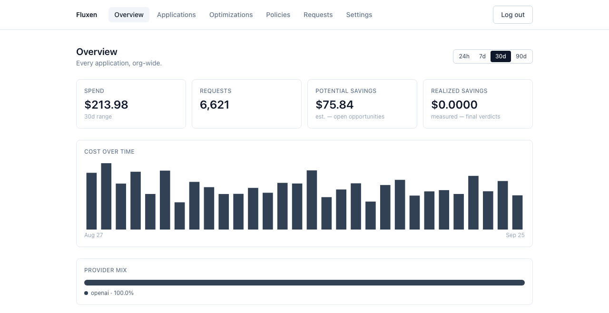
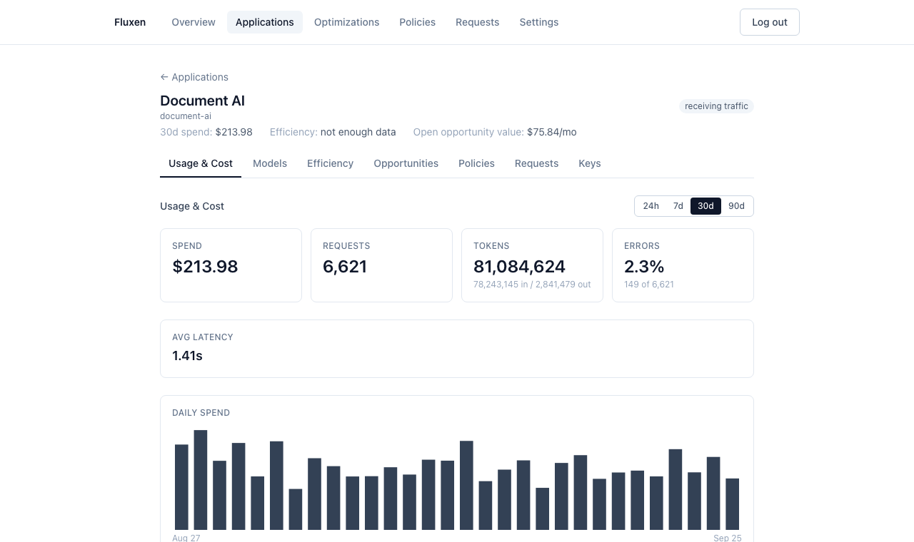
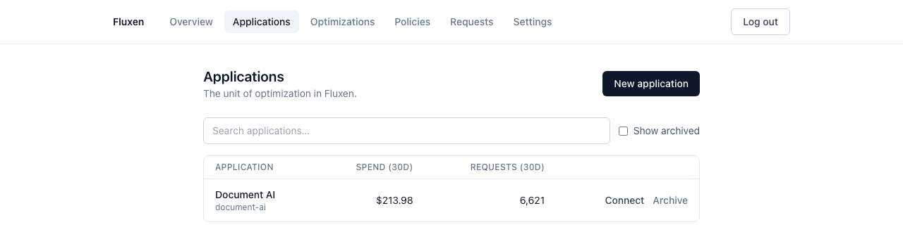
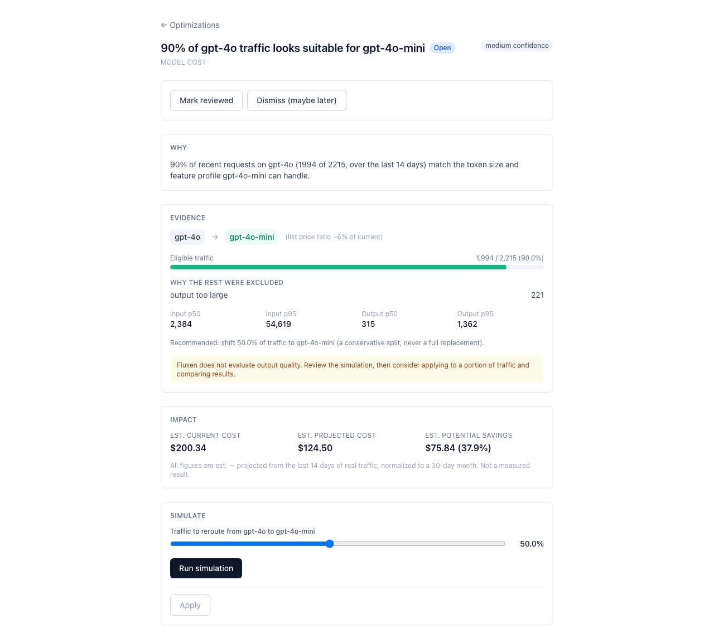

# Fluxen

**AI Traffic, Optimized.**

[](https://github.com/ManojVihari/Fluxen)
[](#run-it)
[](./LICENSE)

Fluxen is a self-hosted gateway for your OpenAI, Gemini, and Ollama traffic that doesn't stop at proxying it — it watches for real inefficiency, proves a fix against your own history before anything changes, applies it safely, and then tells you whether it actually worked.

## Why Fluxen, not just another gateway

Most AI gateways (LiteLLM, Portkey, Cloudflare AI Gateway, Kong) give you one endpoint across providers, load balancing, and a cost dashboard. That's the plumbing — real, necessary, and increasingly commoditized. None of them close the loop from *"here's your traffic"* to *"here's exactly what to change, proof it will work, and confirmation that it did."*

Fluxen is built to be the decision layer, not another proxy:

- **Evidence before action.** Every finding shows its sample size, eligible traffic share, and confidence — before you're asked to do anything.
- **Simulation before production.** Nothing changes live traffic until you've seen the real, replayed cost delta against your own request history — not a guess.
- **Measured, not assumed.** Every applied change gets a real before/after verdict 7 and 14 days later, with one-click revert if it regressed.
- **Self-hosted, not a SaaS.** Your traffic, your Postgres, your infrastructure — no vendor roadmap deciding what happens to the tool next.

## Screenshots

| Overview — org-wide spend, savings, and traffic in one place | Application Detail — per-app usage, cost, and efficiency |
|---|---|
|  |  |

| Applications — search, connect, archive | An opportunity: evidence, simulated impact, and a one-click apply |
|---|---|
|  |  |

## How it works

1. **Understand** — every request through the gateway is accounted for: cost, tokens, model, provider, latency, cache status. No sampling, no estimation.
2. **Identify** — detectors continuously look for evidence-backed inefficiency: an overpowered model, repeated requests worth caching, token drift, traffic anomalies.
3. **Simulate** — before anything changes, Fluxen replays the scenario against your real historical traffic and shows the actual cost delta.
4. **Control** — apply a proven change with one confirmed action: percentage-based model routing, exact caching, budgets, rate limits, or model restrictions.
5. **Measure** — every applied change gets a real verdict against real traffic — successful, partial, no effect, or regressed — with one-click revert.

## Run it

Requires only [Docker](https://docs.docker.com/get-docker/) and Docker Compose. No `.env` file, no API key, no manual encryption-key setup — every setting has a working default.

```bash
git clone https://github.com/ManojVihari/Fluxen.git
cd Fluxen
docker compose up --build
```

This brings up four services — Postgres, Redis, the combined gateway/control binary (`:8080`), and the dashboard (`:3000`) — with migrations applied automatically. Open [http://localhost:3000](http://localhost:3000); a fresh install routes you to the one-time setup wizard.

Want to see it with real-looking data immediately, without connecting anything yourself?

```bash
docker compose exec fluxen fluxenctl seed --demo
```

Then add a provider credential from **Settings → Providers** (encrypted at rest automatically — nothing to configure), create an application, and point your existing OpenAI client at Fluxen by changing two lines:

```python
from openai import OpenAI

client = OpenAI(base_url="http://localhost:8080/v1", api_key="fx_live_...")
client.chat.completions.create(
    model="gpt-4o-mini",
    messages=[{"role": "user", "content": "Hello, Fluxen!"}],
)
```

**Developing Fluxen itself**, rather than just running it? See [`docs/self-hosting.md`](./docs/self-hosting.md) for the local (non-Docker) dev loop, the full environment variable reference, security notes, and the load-testing methodology.

## Documentation

- [`docs/quickstart.md`](./docs/quickstart.md) — the walkthrough above, in more detail.
- [`docs/self-hosting.md`](./docs/self-hosting.md) — deployment topology, configuration, security, and load testing.
- [`docs/concepts.md`](./docs/concepts.md) — applications, opportunities, policies, the Efficiency Score, and how Fluxen labels a number as estimated vs. measured.
- [`docs/providers.md`](./docs/providers.md) — configuring OpenAI, Gemini, and Ollama credentials.
- [`docs/api-reference.md`](./docs/api-reference.md) — the control API's full request/response shapes.
- [`Fluxen V1 — Product Requirements Document.md`](./Fluxen%20V1%20—%20Product%20Requirements%20Document.md) and [`Fluxen V1 — Implementation Plan.md`](./Fluxen%20V1%20—%20Implementation%20Plan.md) — the original product and engineering specification, for anyone digging into *why* something works the way it does.

## License

[Apache 2.0](./LICENSE).
